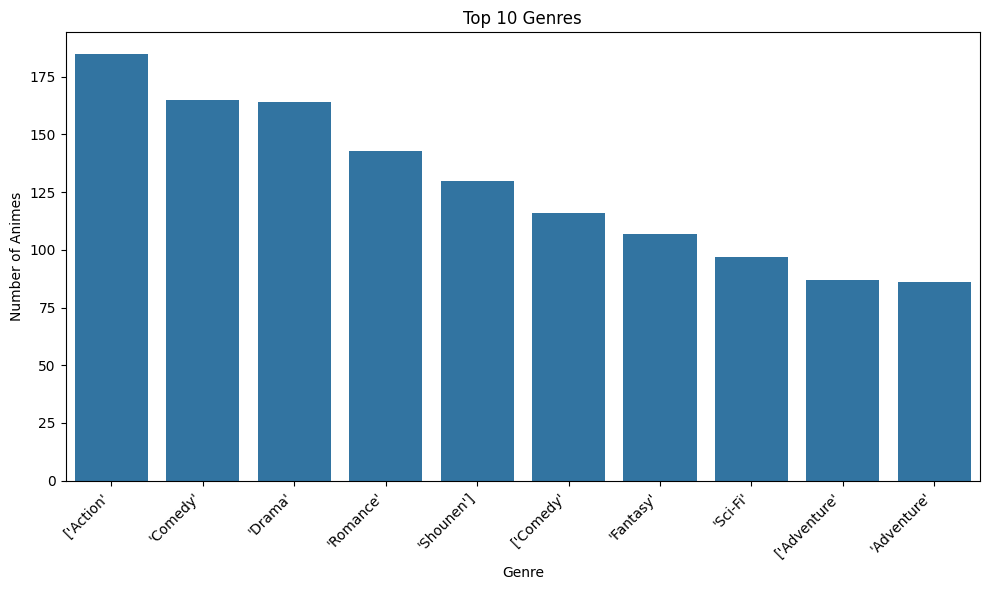
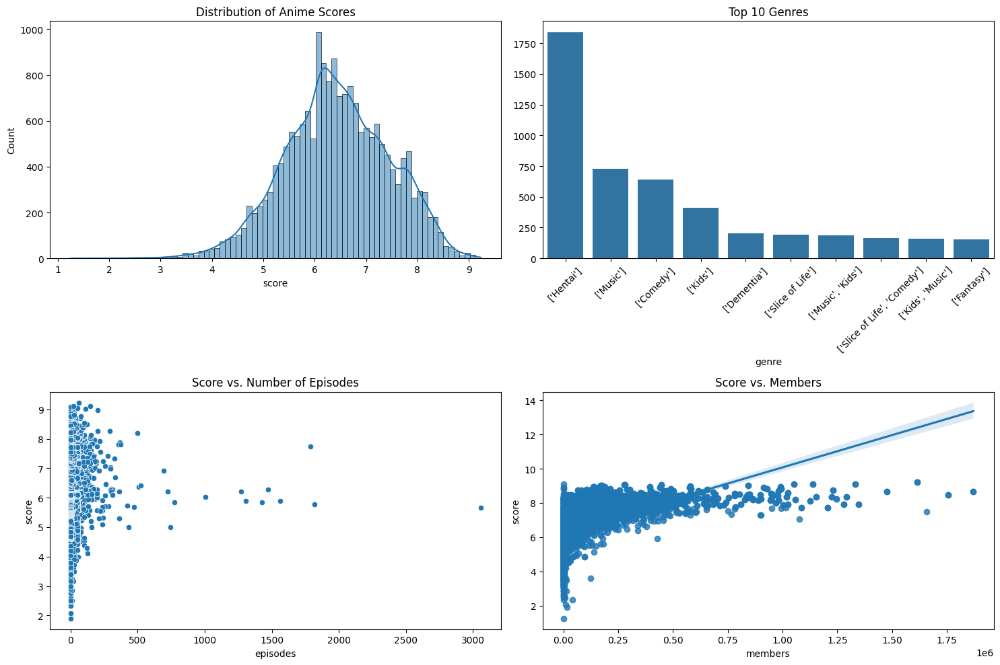
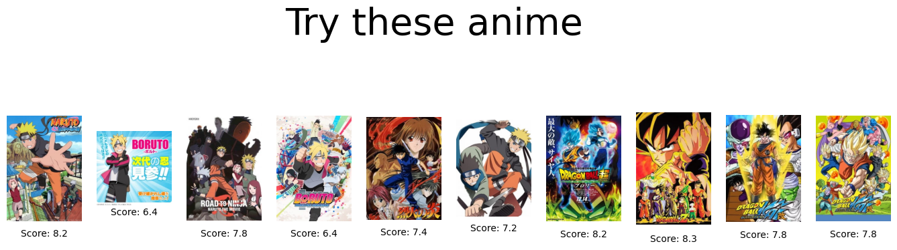
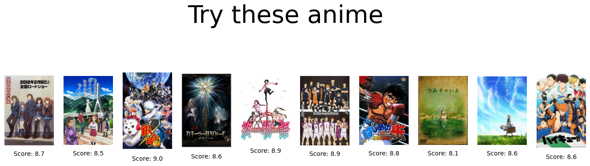

# Laporan Proyek Machine Learning - Andi Sadapotto

## Project Overview

Anime adalah istilah yang digunakan untuk menyebut animasi yang berasal dari Jepang. Meskipun kata "anime" sendiri berasal dari kata bahasa Inggris "animation", di luar Jepang, istilah ini secara khusus merujuk pada animasi yang diproduksi di Jepang. Anime berpotensi menghasilkan berbagai jenis pengaruh budaya kepada pemirsanya [Fennell, D](https://journals.sagepub.com/doi/abs/10.1177/1527476412436986), maka dari itu penting untuk memberikan rekomendasi konten yang sesuai dengan preferensi pengguna.

Proyek ini bertujuan untuk mengembangkan sistem rekomendasi anime untuk mengatasi banyaknya pilihan yang dihadapi pemirsa di dunia anime yang luas dan terus berkembang. Menemukan anime yang sesuai dengan selera individu bisa memakan waktu dan menantang. Sistem ini berupaya mengatasi masalah ini dengan memberikan rekomendasi yang dipersonalisasi yang disesuaikan dengan preferensi pengguna, riwayat penayangan, dan tren populer. Tujuannya adalah untuk menghubungkan pemirsa dengan anime yang mungkin mereka sukai, mempromosikan penemuan permata tersembunyi dan meningkatkan pengalaman menonton mereka secara keseluruhan. Hal ini penting di era dengan konten yang berlimpah, di mana rekomendasi yang dipersonalisasi merupakan kunci untuk menavigasi lanskap digital yang luas. 

Dengan memanfaatkan teknik pembelajaran mesin, sistem akan menganalisis data untuk mengidentifikasi pola untuk merekomendasikan anime yang sesuai dengan preferensi pengguna.

<!-- Pada bagian ini, Kamu perlu menuliskan latar belakang yang relevan dengan proyek yang diangkat.

**Rubrik/Kriteria Tambahan (Opsional)**:
- Jelaskan mengapa proyek ini penting untuk diselesaikan.
- Menyertakan hasil riset terkait atau referensi. Referensi yang diberikan harus berasal dari sumber yang kredibel dan author yang jelas.
  
  Format Referensi: [Judul Referensi](https://scholar.google.com/)  -->

## Business Understanding

<!-- Pada bagian ini, Anda perlu menjelaskan proses klarifikasi masalah. 

Bagian laporan ini mencakup:-->

### Problem Statements
Berdasarkan *Project Overview* diatas, berikut beberapa rincian masalah yang dapat dibahas pada proyek ini.

- Genre anime apa saja yang paling diminati oleh pemirsa?
- Bagaimana memberikan rekomendasi anime berdasarkan preferensi pemirsa?
- Bagaimana membuat model rekomendasi anime berdasarkan preferensi pemirsa?

### Goals

Berdasarkan *Problem statements* diatas, berikut beberapa goals yang diharapkan dari proyek ini:
- Mengetahui genre anime yang paling diminati oleh pemirsa.
- Memberikan rekomendasi anime yang sesuai dengan preferensi pemirsa.
- Membuat model *Machine Learning* untuk merekomendasikan anime berdasarkan preferensi pemirsa.

### Solution statements

Berdasarkan *Goals* diatas, berikut solusi yang dapat dilakukan:
- Dengan melaukan Explorasi Data Analysis dan Visualiasi data untuk mengetahui top n genre yang paling diminati oleh pemirsa
- Menggunakan algoritma Collaborative Filtering untuk memberikan rekomendasi anime yang sesuai dengan preferensi pemirsa.
- Menggunakan MAE dan RMSE untuk mengevaluasi kinerja model.


<!-- ### Constraints

Semua poin di atas harus diuraikan dengan jelas. Anda bebas menuliskan berapa pernyataan masalah dan juga goals yang diinginkan.

**Rubrik/Kriteria Tambahan (Opsional)**:
- Menambahkan bagian “Solution Approach” yang menguraikan cara untuk meraih goals. Bagian ini dibuat dengan ketentuan sebagai berikut: 

    ### Solution statements
    - Mengajukan 2 atau lebih solution approach (algoritma atau pendekatan sistem rekomendasi). -->

## Data Understanding

Dataset yang digunakan untuk merekomendasikan anime pada pengguna diambil dari situs penyedia dataset kaggle yang dapat diakses dihalaman [ini](https://www.kaggle.com/datasets/marlesson/myanimelist-dataset-animes-profiles-reviews/data) yang didapatkan dari API [MyAnimelist](https://myanimelist.net/clubs.php?cid=13727) yang dipublikasikan oleh [Marlesson](https://www.kaggle.com/marlesson) dengan usability 10.00. Dataset ini terdiri dari 3 file, animes.csv, reviews.csv, profiles.csv.

### Variabel-variabel pada dataset adalah sebagai berikut:
- animes.csv memiliki 19311 baris dan 12 kolom dengan deskripsi sebagai berikut

Variable | Keterangan
------|------
uid| Kode unik untuk tiap anime
title| Judul dari anime
synopsis| Ringkasan atau ikhtisar dari sebuah anime
genre| List genre dari anime
aired| Tanggal tayang
episodes| Jumlah episode
members| Total member pada komunitas
popularity| Popularitas di situs MyAnimelist
ranked| Rangking/peringkat di situs MyAnimelist
score| Skor/rating di situs MyAnimelist
img_url|link thumbnail anime
link|link anime di MyAnimelist

- reviews.csv memiliki 192112 baris dan 7 kolom dengan deskripsi sebagai berikut

Variable | Keterangan
------|------
uid| id unik untuk masing-masing review
profile| username dari pengguna yang memberikan review
anime_uid| anime uid yang di review
text| text review
score| overall skor review yang diberikan
scores |detail score yang diberikan
link| link detail review

- profiles.csv memiliki 81727 baris dan 5 kolom dengan deskripsi sebagai berikut

Variable | Keterangan
------|------
profile | username unik untuk tiap pengguna
gender | jenis kelamin
birthday | tanggal lahir
favorites_anime | list anime favorit
link | link profil pengguna

- Cek *missing value* pada animes.csv

Variabel|Value
------|------
uid|0
title|0
synopsis|975
genre|0
aired|0
episodes|706
members|0
popularity|0
ranked|3212
score|579
img_url|180
link|0

- Cek *missing value* pada reviews.csv

Variabel|Value
------|------
uid|0
profile|0
anime_uid|0
text|0
score|0
scores|0
link|0

- Cek *missing value* pada profiles.csv

Variabel|Value
------|------
profile|0
gender|27871
birthday|34920
favorites_anime|0
link|0

- Deskripsi statistik dari anime dataset

|index|uid|title|synopsis|genre|aired|episodes|members|popularity|ranked|score|img\_url|link|
|---|---|---|---|---|---|---|---|---|---|---|---|---|
|count|19311\.0|19311|18336|19311|19311|18605\.0|19311\.0|19311\.0|16099\.0|18732\.0|19131|19311|
|unique|NaN|16214|15194|4851|11127|NaN|NaN|NaN|NaN|NaN|16051|16216|
|top|NaN|Hakkenden: Touhou Hakken Ibun 2nd Season|No synopsis has been added for this series yet\. 
 Click here  to update this information\.|\['Hentai'\]|Not available|NaN|NaN|NaN|NaN|NaN|https://cdn\.myanimelist\.net/images/anime/1071/94957\.jpg|https://myanimelist\.net/anime/18055/Hakkenden\_\_Touhou\_Hakken\_Ibun\_2nd\_Season|
|freq|NaN|3|46|1837|372|NaN|NaN|NaN|NaN|NaN|3|3|
|mean|19358\.904096111026|NaN|NaN|NaN|NaN|11\.46041386723999|34726\.09455750608|7720\.830303971829|6866\.52419404932|6\.4361066623959005|NaN|NaN|
|std|14271\.446515209223|NaN|NaN|NaN|NaN|47\.95038606183757|112177\.18738694287|4676\.786103882217|4390\.018767563312|1\.007940646439764|NaN|NaN|
|min|1\.0|NaN|NaN|NaN|NaN|1\.0|25\.0|1\.0|1\.0|1\.25|NaN|NaN|
|25%|4833\.5|NaN|NaN|NaN|NaN|1\.0|388\.0|3725\.0|2895\.5|5\.77|NaN|NaN|
|50%|18327\.0|NaN|NaN|NaN|NaN|2\.0|2389\.0|7539\.0|6963\.0|6\.41|NaN|NaN|
|75%|33896\.5|NaN|NaN|NaN|NaN|12\.0|14501\.5|11613\.0|10601\.5|7\.15|NaN|NaN|
|max|40960\.0|NaN|NaN|NaN|NaN|3057\.0|1871043\.0|16338\.0|14675\.0|9\.23|NaN|NaN|

- Deskripsi statistik dari review dataset

|index|uid|profile|anime\_uid|text|score|scores|link|
|---|---|---|---|---|---|---|---|
|count|192112\.0|192112|192112\.0|192112|192112\.0|192112|192112|
|unique|NaN|47885|NaN|130440|NaN|29837|130519|
|top|NaN|Sidewinder51|NaN|more pics  Overall 10 Story 10 Animation 10 Sound 10 Character 10 Enjoyment 10  ...|https://myanimelist\.net/reviews\.php?id=321183|
|freq|NaN|762|NaN|8|NaN|13900|4|
|mean|187648\.127524569|NaN|15273\.300283168152|NaN|7\.570235071208462|NaN|NaN|
|std|98748\.90239739003|NaN|13480\.565378925496|NaN|2\.255167441795442|NaN|NaN|
|min|1\.0|NaN|1\.0|NaN|0\.0|NaN|NaN|
|25%|101779\.5|NaN|2167\.0|NaN|6\.0|NaN|NaN|
|50%|210913\.5|NaN|10793\.0|NaN|8\.0|NaN|NaN|
|75%|270383\.0|NaN|30205\.0|NaN|9\.0|NaN|NaN|
|max|325747\.0|NaN|40807\.0|NaN|11\.0|NaN|NaN|




Berikut beberapa hal yang didapatkan setelah dilakukan Eplorasi dan visualisasi data
* **Kualitas Data:** Terdapat beberapa data duplikat dan hilang.  Mengatasi masalah ini sangat penting untuk mendapatkan analisis yang akurat dan rekomendasi yang dapat diandalkan.
* **Popularitas Genre:** Dengan menggabungkan dataset anime dan review, dapat dilakukan referensi silang antara genre populer dengan pola ulasan pengguna untuk mendapatkan gambaran yang lebih lengkap tentang preferensi genre tertentu.
* **Collaborative Filtering:** Data menunjukkan bahwa teknik seperti Collaborative Filtering mungkin berhasil, karena data berisi informasi tentang preferensi pengguna (ulasan) dan informasi tentang pengguna serupa.


<!-- Paragraf awal bagian ini menjelaskan informasi mengenai jumlah data, kondisi data, dan informasi mengenai data yang digunakan. Sertakan juga sumber atau tautan untuk mengunduh dataset. Contoh: [UCI Machine Learning Repository](https://archive.ics.uci.edu/ml/datasets/Restaurant+%26+consumer+data).

Selanjutnya, uraikanlah seluruh variabel atau fitur pada data. Sebagai contoh:  

Variabel-variabel pada Restaurant UCI dataset adalah sebagai berikut:
- accepts : merupakan jenis pembayaran yang diterima pada restoran tertentu.
- cuisine : merupakan jenis masakan yang disajikan pada restoran.
- dst

**Rubrik/Kriteria Tambahan (Opsional)**:
- Melakukan beberapa tahapan yang diperlukan untuk memahami data, contohnya teknik visualisasi data beserta insight atau exploratory data analysis. -->

## Data Preparation

### Mengatasi data duplikat

Untuk mengatasi data duplikat, digunakan teknik drop duplikat menggunakan fungsi pada pandas dataframe.
Hal ini perlu dilakukan karena data duplikat dapat menyebabkan bias dalam hasil analisis karena data tersebut akan dihitung lebih dari sekali. Selain itu, data duplikat juga dapat menurunkan akurasi model machine learning dan memperlambat proses komputasi. Dengan menghapus data duplikat, kita memastikan bahwa setiap data hanya dihitung sekali, sehingga hasil analisis menjadi lebih akurat dan relevan.

### Mengatasi *missing value*

Untuk mengatasi data yang hilang atau *missing value* digunakan beberapa teknik seperti interpolasi, mengisi data berdasarkan mode maupun mengisi dengan data yang dianggap tepat berdasarkan variabel masing-masing.
Hal ini perlu dilakukan karena missing value dapat menyebabkan bias dalam hasil analisis dan menurunkan akurasi model. Data yang hilang dapat mengurangi jumlah data yang dapat digunakan untuk pelatihan model, sehingga mengurangi akurasi model.

### Merge dataset

Menggabungkan dataset anime dan review dengan menggunakan fungsi merge dari padas dataframe.
Hal ini perlu dilakukan karena dataset anime dan review memiliki informasi yang saling terkait dan untuk digunakan membuat model sistem rekomendasi yang berdasarkan preferensi pengguna dimana pada daset anime terdapat kolom genre, title, dan akumulasi score sendangkan pada datset reviews terdapat kolom profile (pengguna), genre(list preferensi genre) dan score (user scored)

### TF-IDF vectorizer

TF-IDF Vectorizer akan mentransformasikan teks menjadi representasi angka yang memiliki makna tertentu dalam bentuk matriks. 
Hal ini perlu dilakukan untuk melakukan perhitungan dan analisis terhadap teks maka teks tersebut di transformasikan kedalam bentuk angka.

### MultiLabelBinarizer
[MultilabelBinarizer](https://scikit-learn.org/dev/modules/generated/sklearn.preprocessing.MultiLabelBinarizer.html) melakukan transormasi pada kategori format multilabel. Dengan kata lain, kelas ini akan mengubah label-label tersebut menjadi vektor biner, di mana setiap elemen dalam vektor mewakili satu kategori, dan nilainya akan 1 jika sampel tersebut memiliki kategori tersebut, atau 0 jika tidak.
Hal ini perlu dilakukan karena dalam setiap anime biasanya terdapat lebih dari satu genre.

### Split dataset

Dalam membangun model pembelajaran mesin, dataset perlu dibagi menjadi dua bagian utama:

- **Data Latih:** Digunakan untuk melatih model. Model akan mempelajari pola dan hubungan antara fitur dan target dalam data latih ini.
- **Data Uji:** Digunakan untuk menguji kinerja model yang telah dilatih. Model akan memprediksi nilai pada data uji, dan hasilnya akan dibandingkan dengan nilai sebenarnya untuk mengevaluasi seberapa baik model tersebut bekerja pada data yang belum pernah dilihat sebelumnya.

Pada proyek ini penulis membagi dataset menjadi 80:20. Pembagian data dengan perbandingan 80:20 adalah salah satu cara yang umum digunakan, artinya 80% data akan digunakan untuk melatih model dan 20% sisanya untuk menguji model.

**Alasan Utama Pembagian Dataset:**

1. Mencegah Overfitting:

    Overfitting adalah kondisi di mana model terlalu cocok dengan data latih sehingga tidak mampu menggeneralisasi dengan baik pada data baru. Model yang overfit akan memiliki kinerja yang sangat baik pada data latih, tetapi performanya akan buruk ketika diuji pada data yang belum pernah dilihat sebelumnya.

    Dengan membagi dataset, kita dapat menguji model pada data uji yang belum pernah digunakan dalam proses pelatihan. Jika model terlalu overfit, performanya pada data uji akan jauh lebih buruk dibandingkan dengan performanya pada data latih.

2. Evaluasi Kinerja Model:

    Data uji digunakan untuk mengevaluasi seberapa baik model dapat memprediksi nilai pada data yang baru. Dengan membandingkan prediksi model dengan nilai sebenarnya pada data uji, kita dapat menghitung metrik evaluasi seperti akurasi, precision, recall, dan F1-score ataupun dengan metrik MSE dll. Metrik-metrik ini memberikan gambaran yang lebih objektif tentang kinerja model.
3. Mencegah Informasi Bocor:

    Jika menggunakan seluruh data untuk melatih model, maka model akan "melihat" semua data, termasuk data yang seharusnya digunakan untuk evaluasi. Hal ini dapat menyebabkan informasi bocor dari data uji ke model, sehingga hasil evaluasi menjadi tidak valid.

<!-- Pada bagian ini Anda menerapkan dan menyebutkan teknik data preparation yang dilakukan. Teknik yang digunakan pada notebook dan laporan harus berurutan.

**Rubrik/Kriteria Tambahan (Opsional)**: 
- Menjelaskan proses data preparation yang dilakukan
- Menjelaskan alasan mengapa diperlukan tahapan data preparation tersebut. -->

## Modeling

### Content Based recomendation
Dengan menggunakan TF-IDF Vectorizer data teks ditransformasikan menjadi representasi angka yang memiliki makna terntentu kedalam bentuk matriks. Selantjutnya matriks tersebut akan dihitung derajat kesamaanya dengan menggunakan Cosine Similarity antar judul dari anime. 

Pertama-tama dimasukkan input judul anime yang diinginkan, kemudian sistem akan mencari anime-anime yang memiliki derajat kemiripan dan memberikan rekomendasi berdasarkan top N
Kemudian didapat Top N recommendation dari anime


#### Kelebihan
- Mudah Diimplementasikan: Metode ini relatif mudah diimplementasikan dan dipahami, terutama dengan adanya pustaka-pustaka seperti scikit-learn yang menyediakan fungsi-fungsi siap pakai.
- Tidak Membutuhkan Data Pengguna Lain: Sistem tidak memerlukan informasi tentang preferensi pengguna lain, sehingga dapat bekerja dengan baik meskipun jumlah pengguna sedikit.
#### Kekurangan
- Overspecialization: Sistem cenderung memberikan rekomendasi yang terlalu spesifik dan monoton, karena hanya fokus pada item yang serupa dengan item yang telah disukai pengguna sebelumnya.

### Collaborative Filtering Recommendation
Metode paling umum untuk sistem rekomendasi sering kali dilengkapi dengan Collaborating Filtering (CF) yang mengandalkan kumpulan data pengguna dan item sebelumnya. adalah model faktor laten, yang mengekstraksi fitur dari matriks pengguna dan item [Denise Chen](https://towardsdatascience.com/recommender-system-singular-value-decomposition-svd-truncated-svd-97096338f361).

Menggunakan model SVD. Singular value decomposition (SVD) adalah metode penyaringan kolaboratif untuk merekomendasikan anime. SVD menggunakan model faktor laten untuk melakukan faktorisasi matriks dan memberikan rekomendasi anime kepada pengguna berdasarkan fitur laten matriks item-user.

Intinya, model menggunakan penilaian pengguna sebelumnya untuk mengidentifikasi preferensi pengguna dan karakteristik anime, memungkinkan model untuk merekomendasikan anime yang dinikmati oleh pengguna serupa atau anime dengan karakteristik yang sesuai dengan preferensi pengguna sebelumnya.

Berikut top-N anime yang direkomendasikan


#### Kelebihan
- Rekomendasi yang Personalisasi: SVD mampu menangkap pola preferensi pengguna yang kompleks, sehingga rekomendasi yang diberikan sangat personal dan relevan dengan minat individu.
- Mampu Menemukan Pola Tersembunyi: SVD dapat mengidentifikasi hubungan laten antara pengguna dan item yang mungkin tidak terlihat secara langsung dari data rating.
#### Kekurangan
- Tidak Dapat Menjelaskan Alasan Rekomendasi: SVD memberikan rekomendasi berdasarkan pola statistik, namun sulit untuk memberikan penjelasan yang jelas mengapa suatu item direkomendasikan.
<!-- Tahapan ini membahas mengenai model sisten rekomendasi yang Anda buat untuk menyelesaikan permasalahan. Sajikan top-N recommendation sebagai output.

**Rubrik/Kriteria Tambahan (Opsional)**: 
- Menyajikan dua solusi rekomendasi dengan algoritma yang berbeda.
- Menjelaskan kelebihan dan kekurangan dari solusi/pendekatan yang dipilih. -->

## Evaluation
<!-- Pada bagian ini Anda perlu menyebutkan metrik evaluasi yang digunakan. Kemudian, jelaskan hasil proyek berdasarkan metrik evaluasi tersebut.

Ingatlah, metrik evaluasi yang digunakan harus sesuai dengan konteks data, problem statement, dan solusi yang diinginkan.

**Rubrik/Kriteria Tambahan (Opsional)**: 
- Menjelaskan formula metrik dan bagaimana metrik tersebut bekerja. -->

#### Mean Absolute Error (MAE)

MAE adalah salah satu metrik yang paling umum digunakan untuk mengukur kinerja model regresi. Metrik ini memberikan kita gambaran tentang seberapa besar, secara rata-rata, prediksi model kita meleset dari nilai aktual.
**Cara Kerja:**
1. **Hitung Selisih Absolut:** Untuk setiap data, kita hitung selisih antara nilai prediksi model dengan nilai aktualnya. Selisih ini kemudian kita ambil nilai absolutnya (artinya kita abaikan tanda positif atau negatif).
2. **Hitung Rata-rata:** Setelah mendapatkan semua selisih absolut, kita hitung rata-rata dari semua selisih tersebut. Hasilnya adalah nilai MAE.

**Rumus MAE**
```
MAE = (1/n) * Σ|y_i - ŷ_i|
```
- n: Jumlah data
- y_i: Nilai aktual data ke-i
- ŷ_i: Nilai prediksi data ke-i
- Σ: Simbol penjumlahan
- | |: Nilai absolut

**Interpretasi Nilai MAE:**
- **Nilai MAE yang kecil:** Menunjukkan bahwa model kita memberikan prediksi yang cukup akurat, karena rata-rata kesalahan prediksi kita kecil.
- **Nilai MAE yang besar:** Menunjukkan bahwa model kita kurang akurat dalam melakukan prediksi, karena rata-rata kesalahan prediksi kita besar.

**Kelebihan MAE:**
- **Mudah diinterpretasikan**: MAE memberikan nilai rata-rata kesalahan dalam satuan yang sama dengan data asli.
- **Robust terhadap outlier**: MAE kurang sensitif terhadap adanya outlier dibandingkan metrik lain seperti MSE (Mean Squared Error).

**Kapan Menggunakan MAE:**
MAE cocok digunakan ketika kita ingin mengukur kesalahan prediksi secara rata-rata dan tidak ingin terlalu terpengaruh oleh nilai ekstrem.

**Hasil MAE pada model**

MAE:  1.5072 (1.5071743372206834)

#### Root Mean Squared Error (RMSE)

RMSE adalah salah satu metrik evaluasi yang paling umum digunakan untuk mengukur kinerja model regresi. Sama seperti MAE, RMSE memberikan kita gambaran tentang seberapa besar, secara rata-rata, prediksi model kita meleset dari nilai aktual. Namun, RMSE memiliki sedikit perbedaan dalam cara menghitungnya.

**Cara Kerja RMSE:**

Hitung Selisih Kuadrat: Untuk setiap data, kita hitung selisih antara nilai prediksi model dengan nilai aktualnya. Selisih ini kemudian kita kuadratkan.
Hitung Rata-rata: Setelah mendapatkan semua selisih kuadrat, kita hitung rata-rata dari semua selisih kuadrat tersebut.
Akar Kuadrat: Terakhir, kita ambil akar kuadrat dari hasil rata-rata selisih kuadrat.

**Rumus RMSE:**

```
RMSE = √( (1/n) * Σ(y_i - ŷ_i)^2 )
```

- n: Jumlah data
- y_i: Nilai aktual data ke-i
- ŷ_i: Nilai prediksi data ke-i
- Σ: Simbol penjumlahan
- √: Akar kuadrat

**Interpretasi Nilai RMSE:**

- **Nilai RMSE yang kecil:** Menunjukkan bahwa model kita memberikan prediksi yang cukup akurat, karena rata-rata kesalahan prediksi kita kecil.
- **Nilai RMSE yang besar:** Menunjukkan bahwa model kita kurang akurat dalam melakukan prediksi, karena rata-rata kesalahan prediksi kita besar.

**Kelebihan RMSE:**

- **Mengukur kesalahan secara kuadratik:** Dengan mengkuadratkan selisih, RMSE memberikan penalti yang lebih besar pada kesalahan yang besar.
- **Sering digunakan:** RMSE adalah salah satu metrik yang paling populer dan sering digunakan dalam berbagai bidang.

**Kapan Menggunakan RMSE:**

RMSE cocok digunakan ketika kita ingin memberikan bobot yang lebih besar pada kesalahan prediksi yang besar dan ingin mengukur akurasi model secara keseluruhan.

**Hasil RMSE pada model**

RMSE: 1.9618 (1.961848952760387)

## Conclusion
Genre anime apa saja yang paling diminati oleh pemirsa?
Bagaimana memberikan rekomendasi anime berdasarkan preferensi pemirsa?
Bagaimana membuat model rekomendasi anime berdasarkan preferensi pemirsa?
1. Berdasarkan data yang diperoleh dapat diketahui genre-genre anime yang paling diminati oleh pemirsa yaitu Action, Comedy, Drama, Romance, Shounen, Fantasy, Sci-Fi, Adventure
2. Dengan menggunakan collaborative filtering - user based, sistem rekomendasi dapat memberikan rekemondasi anime yang sesuai dengan referensi pemirsa.
3. Setelah menguji data dengan menggunakan algoritma Singular value decomposition (SVD) dan melakukan evaluasi terhadap model, sistem rekemondasi yang dibuat dapat memberikan top N anime yang sesuai dengan preferensi pengguna

## References
[1] . Fennell, D., Liberato, A. S. Q., Hayden, B., & Fujino, Y. (2013). Consuming Anime. Television & New Media, 14(5), 440-456. https://doi.org/10.1177/1527476412436986

[2]. Sckit-Learn, diakses 25 November 2024, https://scikit-learn.org/dev/modules/generated/sklearn.preprocessing.MultiLabelBinarizer.html

[3]. Denise Chen, diakses 25 November 2024, https://towardsdatascience.com/recommender-system-singular-value-decomposition-svd-truncated-svd-97096338f361